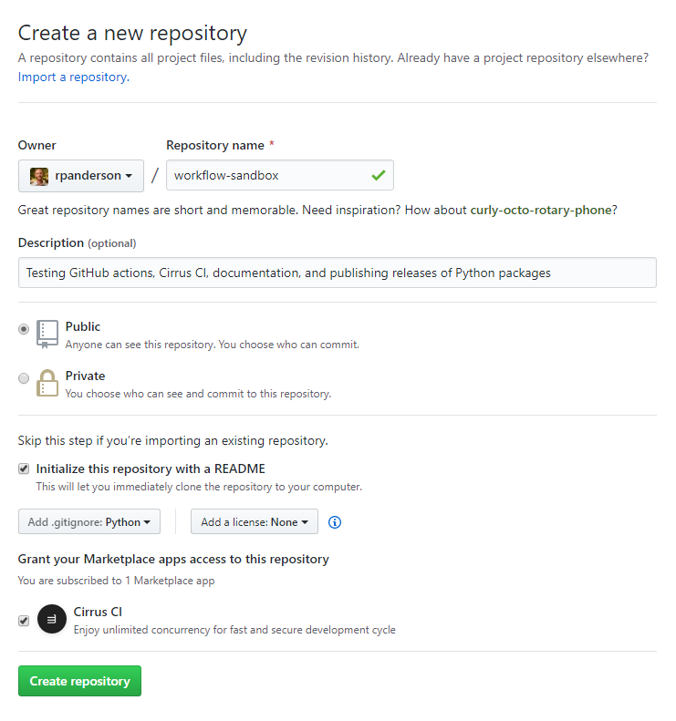

# workflow-sandbox
Testing GitHub actions, Cirrus CI, documentation, and publishing releases of Python packages.

This will be a Python package on test PyPI in its own right, with package name `workflow-sandbox` and module name `workflow_sandbox` (yes, the mixing of hyphenation and underscores is inelegant but deliberate).

## Inception

This repository was created on GitHub using the following settings.



## Development environment

To develop this package, I first cloned the repository (others would fork on GitHub then clone their fork):
```
$ git clone https://github.com/<origin>/workflow-sandbox.git
$ cd workflow-sandbox
```
where `<origin>` is the GitHub account of the fork.

For now, I'm going to use `<origin>=rpanderson` and not work on a fork.

If you are developing on a fork, set the upstream remote:
```
$ git remote add upstream https://github.com/<upstream>/workflow-sandbox.git
```
where `<upstream>` is the base repository used for pull requests and publishing releases and documentation. If you forked your development repository from `https://github.com/rpanderson/workflow-sandbox` for example, you'd use `<upstream>=rpanderson`.

Create a virtual environment:
```
$ python -m venv .venv
$ .venv\Scripts\activate
$ python -m pip install --upgrade pip setuptools wheel
```

## Roadmap

The first port of call will be to test:

### CirrusCI

- Formatting using `black`.
- Linting using `flake8`.
- Hosting documentation using GitHub pages (on an orphaned `gh-pages` branch).

### GitHub actions

- Create release using `actions/create_release`:
:
```yaml
    tag_name: ${{ github.ref }}
    release_name: ${{ env.tag }}
    body: ${{ steps.release_notes.outputs.contents }}
    prerelease: ${{ contains(github.ref, 'rc') }}
```

- Publish release on GitHub using `actions/upload-release-asset` with the `body` above extracted from the appropriate release notes based on git tags as per [napari/napari#1138](https://github.com/napari/napari/pull/1138).

- Publish on PyPI using `pypa/gh-action-pypi-publish`.

### Acknowledgements

Much of this is guided by the practices of other development communities—especially [`napari`](https://github.com/orgs/napari/people) (and, increasingly, [`labscript-suite`](https://github.com/orgs/labscript-suite/people))—and many helpful conversations with [@chrisjbillington](https://github.com/chrisjbillington) and [@philipstarkey](https://github.com/philipstarkey).
